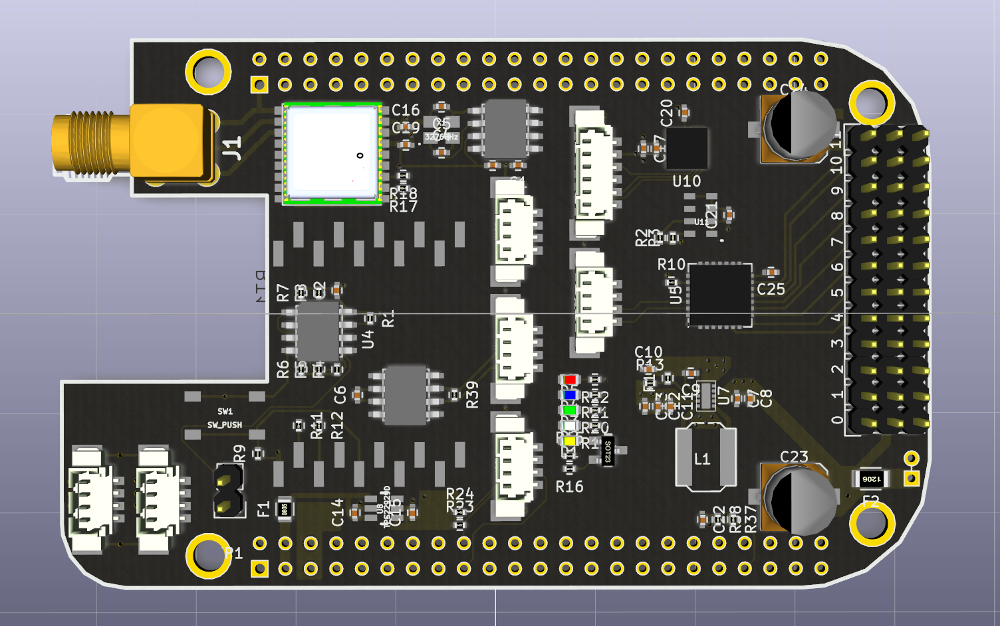
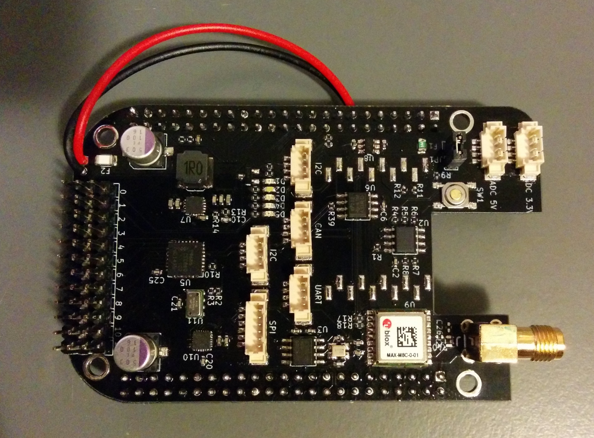

# RoboCape

This repository is dedicated to a Beaglebone cape extension developped at EPFL in the Automatic Control Laboratory.
The idea of this platform is to allow the user to transform any mechanically actuated platform, for example a RC car or a quadcopter base, into a robotic vehicle that can be controlled by a remote server.

The repository contains all the design files of the Beaglebone cape extension.
* Schematic
* PCB layout
* Production files
* Documentation files (useful documents and datasheets)

## Finished board

## License

This project is released under the Creative Commons CC-BY-4.0 license.
See http://creativecommons.org/licenses/by/4.0/ for details.
